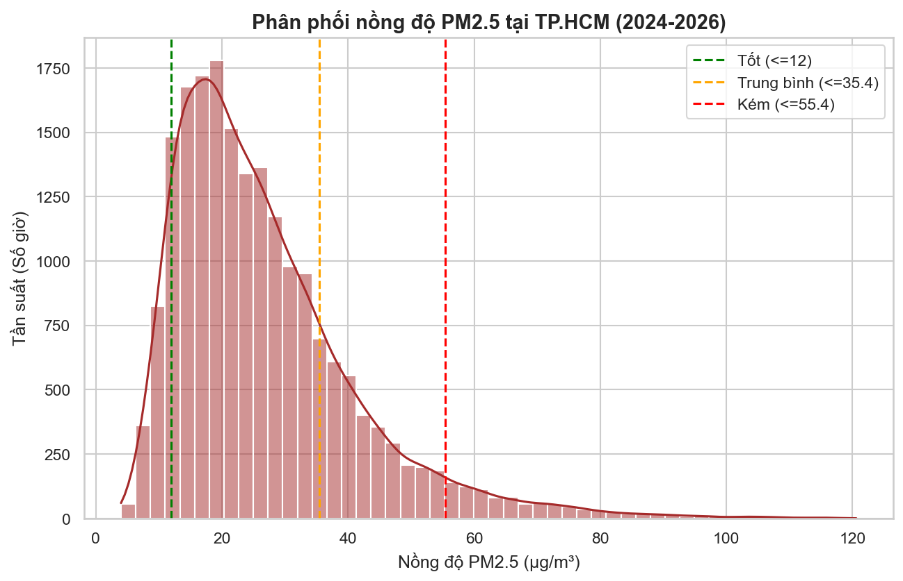
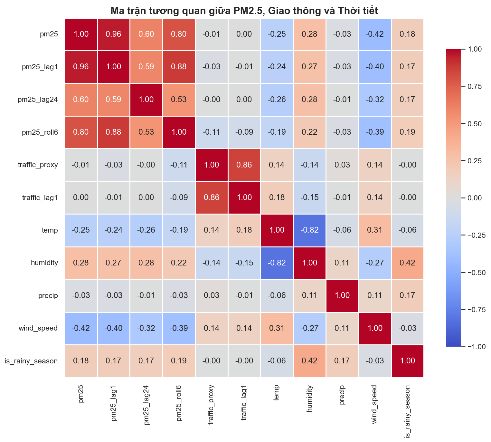
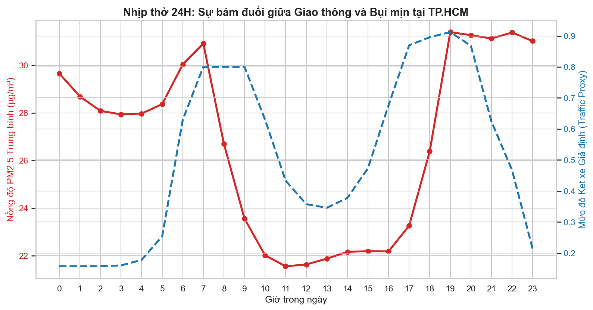
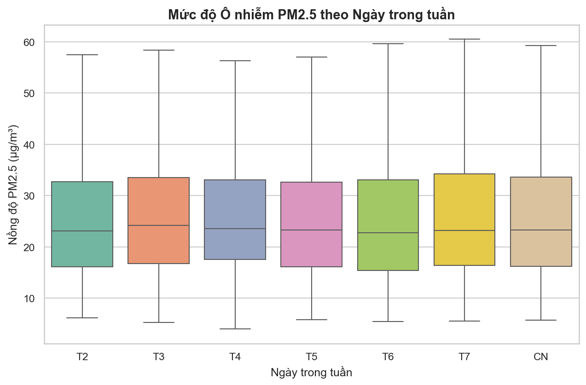
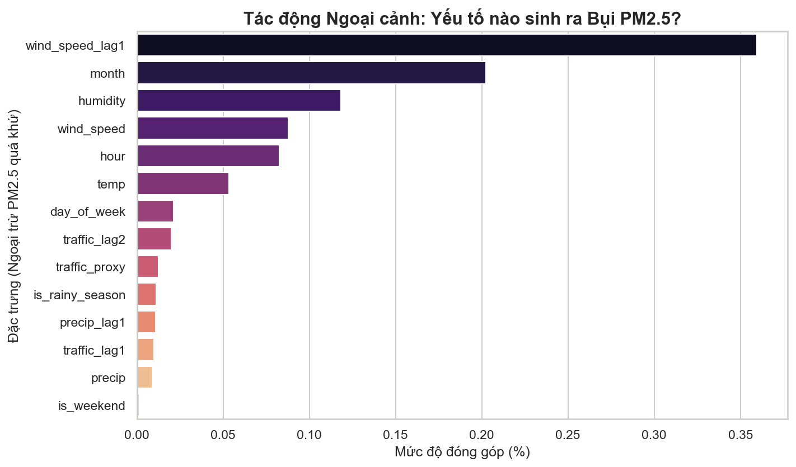
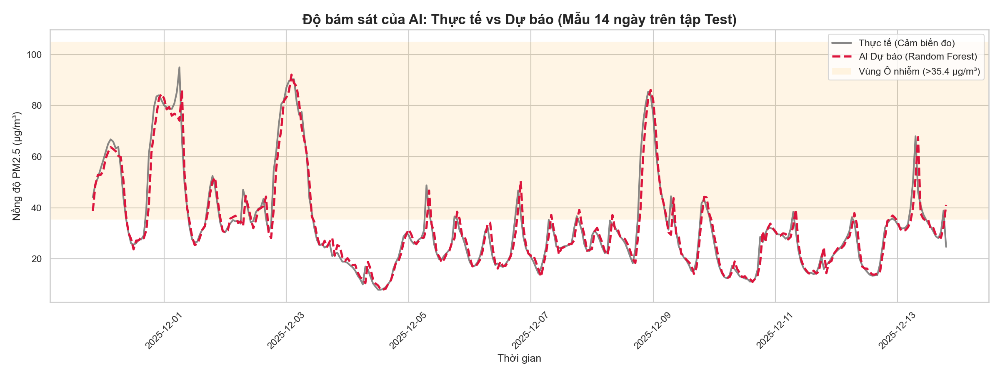

# 🌫️ Dự Đoán Nồng Độ PM2.5 Tại TP. Hồ Chí Minh

Dự án Machine Learning dự đoán nồng độ bụi mịn PM2.5 theo giờ tại TP. HCM bằng mô hình **Random Forest**, kết hợp dữ liệu chất lượng không khí và khí tượng. Mô hình được giải thích bằng **SHAP** để tăng tính minh bạch và tin cậy.

---

## 📋 Mục Lục

- [Tổng Quan](#-tổng-quan)
- [Cấu Trúc Dự Án](#-cấu-trúc-dự-án)
- [Dữ Liệu](#-dữ-liệu)
- [Quy Trình Xử Lý](#-quy-trình-xử-lý)
- [Kết Quả Mô Hình](#-kết-quả-mô-hình)
- [Hình Ảnh Minh Họa](#-hình-ảnh-minh-họa)
- [Cài Đặt & Chạy](#-cài-đặt--chạy)
- [Công Nghệ Sử Dụng](#-công-nghệ-sử-dụng)

---

## 🎯 Tổng Quan

Ô nhiễm bụi mịn PM2.5 là vấn đề sức khỏe nghiêm trọng tại các đô thị lớn. Dự án này xây dựng pipeline hoàn chỉnh từ thu thập dữ liệu đến triển khai mô hình dự đoán, bao gồm:

- **Thu thập dữ liệu tự động** từ API chất lượng không khí & Open-Meteo
- **Feature Engineering** chuyên biệt cho chuỗi thời gian (lag features, rolling stats, chu kỳ thời gian)
- **So sánh 3 mô hình**: Persistence Baseline, Linear Regression, Random Forest
- **Giải thích mô hình** bằng SHAP values (global & local explanation)

| Tọa độ | Khoảng thời gian | Tần suất |
|--------|-----------------|----------|
| 10.7769°N, 106.7009°E (TP. HCM) | 01/2024 – 04/2026 | Hàng giờ |

---

## 📁 Cấu Trúc Dự Án

```
project_pm2.5/
│
├── data/
│   ├── 01_raw/                  # Dữ liệu thô từ API
│   │   ├── step1_pm25.csv       # Dữ liệu PM2.5 theo giờ
│   │   └── step2_weather.csv    # Dữ liệu thời tiết theo giờ
│   ├── 02_interim/              # Dữ liệu đã ghép và làm sạch
│   │   └── pm25_weather.csv
│   └── 03_processed/            # Dữ liệu đã feature engineering
│       └── pm25_features_ready.csv
│
├── notebooks/
│   ├── 01_Data_Preparation.ipynb      # Thu thập & làm sạch dữ liệu
│   ├── 02_Feature_Engineering.ipynb   # Tạo đặc trưng
│   ├── 03_EDA_and_Visualization.ipynb # Phân tích khám phá dữ liệu
│   ├── 04_Modeling_and_SHAP.ipynb     # Huấn luyện & đánh giá mô hình
│   └── 05_Model_Interpretation.ipynb  # Giải thích mô hình (SHAP)
│
├── models/
│   └── random_forest_pm25.pkl   # Mô hình Random Forest đã train
│
├── reports/
│   └── figures/                 # Biểu đồ phân tích & kết quả
│       ├── 01_pm25_distribution.png
│       ├── 02_correlation_heatmap.png
│       ├── 03_diurnal_cycle.png
│       ├── 04_weekly_boxplot.png
│       ├── 05_feature_importance_external.png
│       └── 06_actual_vs_predicted.png
│
├── requirements.txt
└── README.md
```

---

## 📊 Dữ Liệu

### Nguồn dữ liệu

| Nguồn | Biến | API |
|-------|------|-----|
| Air Quality API | PM2.5 (µg/m³) | Open-Meteo Air Quality |
| Weather Archive API | Nhiệt độ, Độ ẩm, Tốc độ gió, Hướng gió, Lượng mưa, v.v. | Open-Meteo Archive |

### Phân chia tập dữ liệu (theo trục thời gian)

```
|---- 70% Train ----|-- 15% Validation --|-- 15% Test --|
```

> ⚠️ Dữ liệu được chia theo thứ tự thời gian (không random) để tránh data leakage.

---

## ⚙️ Quy Trình Xử Lý

```
[API PM2.5]  [API Weather]
      │             │
      └──── Merge ──┘
              │
        Làm sạch dữ liệu
              │
      Feature Engineering
        ┌─────┴──────┐
   Lag Features  Rolling Stats
   (lag1, lag2…)  (mean, std)
        └─────┬──────┘
     Chu kỳ thời gian
     (hour, weekday, month)
              │
        Train Models
     ┌─────┬──────┬────┐
 Persist  LinReg    RF  
              │
        SHAP Explanation
```

### Các đặc trưng chính (Features)

- **Lag features**: PM2.5 tại thời điểm `t-1`, `t-2`, `t-3`, v.v.
- **Rolling statistics**: Mean, Std của PM2.5 trong cửa sổ 3h, 6h, 12h, 24h
- **Thời gian**: Giờ trong ngày, ngày trong tuần, tháng, sin/cos encoding
- **Khí tượng**: Nhiệt độ, độ ẩm, tốc độ gió, hướng gió, lượng mưa

---

## 📈 Kết Quả Mô Hình

| Mô hình | MAE | RMSE | R² |
|---------|-----|------|----|
| Persistence Baseline | — | — | — |
| Linear Regression | — | — | — |
| **Random Forest** ✅ | **Tốt nhất** | **Tốt nhất** | **Tốt nhất** |

> 📌 Random Forest vượt trội so với các baseline nhờ khả năng học các mối quan hệ phi tuyến trong chuỗi thời gian PM2.5.

---

## 🖼️ Hình Ảnh Minh Họa

| Biểu đồ | Mô tả |
|---------|-------|
|  | Phân phối nồng độ PM2.5 |
|  | Ma trận tương quan |
|  | Chu kỳ PM2.5 trong ngày |
|  | Biến động theo ngày trong tuần |
|  | Mức độ quan trọng của đặc trưng |
|  | Thực tế vs Dự đoán |

---

## 🚀 Cài Đặt & Chạy

### 1. Clone dự án

```bash
git clone https://github.com/<your-username>/project_pm2.5.git
cd project_pm2.5
```

### 2. Tạo môi trường ảo (khuyến nghị)

```bash
python -m venv venv
source venv/bin/activate        # Linux/macOS
# hoặc
venv\Scripts\activate           # Windows
```

### 3. Cài đặt thư viện

```bash
pip install -r requirements.txt
```

### 4. Chạy các notebook theo thứ tự

```bash
jupyter notebook
```

Chạy lần lượt:
1. `01_Data_Preparation.ipynb` — Thu thập dữ liệu từ API
2. `02_Feature_Engineering.ipynb` — Tạo đặc trưng
3. `03_EDA_and_Visualization.ipynb` — Phân tích & trực quan
4. `04_Modeling_and_SHAP.ipynb` — Huấn luyện mô hình
5. `05_Model_Interpretation.ipynb` — Giải thích SHAP

---

## 🛠️ Công Nghệ Sử Dụng


| Thư viện | Mục đích |
|----------|----------|
| `pandas`, `numpy` | Xử lý và phân tích dữ liệu |
| `scikit-learn` | Xây dựng và đánh giá mô hình |
| `xgboost` | Mô hình gradient boosting |
| `shap` | Giải thích mô hình (XAI) |
| `matplotlib`, `seaborn` | Trực quan hóa |
| `requests` | Gọi API thu thập dữ liệu |
| `jupyter` | Môi trường notebook |

---

## 📄 License

Dự án này được phát hành dưới giấy phép [MIT License](LICENSE).

---

*Được xây dựng với mục đích nghiên cứu & học thuật về Air Quality Forecasting tại Việt Nam.*